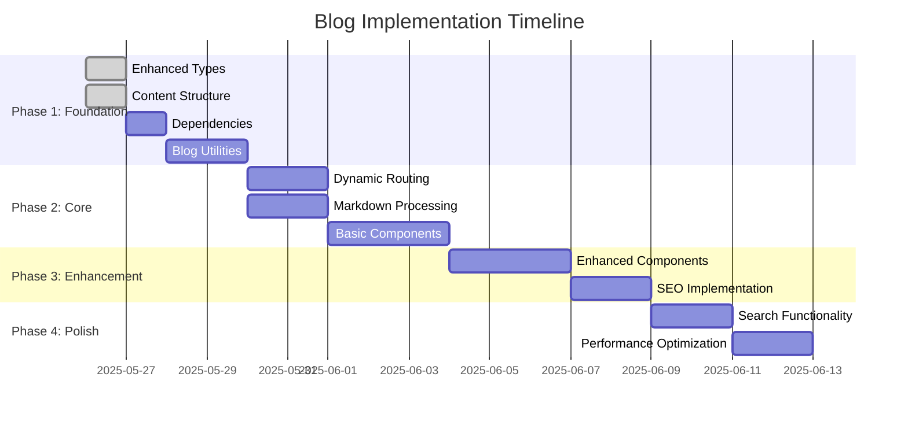

# Blog Implementation Plan: Markdown-Based System

## Overview
Transform the current static blog system into a dynamic, markdown-based blogging platform that prioritizes simplicity and quick content creation.

## Current State Analysis

### Existing Components
- [`src/components/BlogGrid/blogData.ts`](src/components/BlogGrid/blogData.ts) - Static blog data array
- [`src/types/blogItem.ts`](src/types/blogItem.ts) - Basic blog item type (date, views, title, img)
- [`src/components/Blog/BlogItem.tsx`](src/components/Blog/BlogItem.tsx) - Blog preview card component
- [`src/components/BlogDetails/index.tsx`](src/components/BlogDetails/index.tsx) - Static blog detail page
- [`src/components/BlogGrid/index.tsx`](src/components/BlogGrid/index.tsx) - Blog grid layout

### Current Limitations
- Hardcoded blog data
- No actual content storage
- Static detail pages
- No dynamic routing
- Limited metadata
- No SEO optimization

## Implementation Plan

### Phase 1: Foundation Setup ⭐ (Priority 1)

#### 1.1 Enhanced Type Definitions
**File**: `src/types/blog.ts`
```typescript
export interface BlogPost {
  slug: string;
  title: string;
  excerpt: string;
  content: string;
  date: string;
  publishedAt: Date;
  updatedAt?: Date;
  author: Author;
  categories: string[];
  tags: string[];
  featuredImage: string;
  readingTime: number;
  views: number;
  seo: SEOMetadata;
  status: 'draft' | 'published';
}

export interface Author {
  name: string;
  bio?: string;
  avatar?: string;
  social?: {
    twitter?: string;
    linkedin?: string;
    github?: string;
  };
}

export interface SEOMetadata {
  metaTitle?: string;
  metaDescription?: string;
  keywords?: string[];
  ogImage?: string;
}

export interface TOCItem {
  id: string;
  title: string;
  level: number;
}
```

#### 1.2 Content Directory Structure
```
content/
  blog/
    getting-started-with-ecommerce.md
    product-photography-tips.md
    seo-best-practices.md
  authors/
    john-doe.md
    jane-smith.md
public/
  images/
    blog/
      (blog post images)
```

#### 1.3 Markdown Frontmatter Format
```yaml
---
title: "Getting Started with E-commerce"
excerpt: "A comprehensive guide to launching your first online store"
date: "2025-05-26"
author: "john-doe"
categories: ["ecommerce", "business"]
tags: ["startup", "online-store", "guide"]
featuredImage: "/images/blog/ecommerce-guide.jpg"
seo:
  metaTitle: "E-commerce Startup Guide | Tommy Zion"
  metaDescription: "Learn how to start your e-commerce business with our step-by-step guide"
  keywords: ["ecommerce", "startup", "online business"]
status: "published"
---

# Your blog content here in Markdown

This is the actual content of your blog post...
```

#### 1.4 Required Dependencies
```json
{
  "dependencies": {
    "gray-matter": "^4.0.3",
    "remark": "^14.0.3",
    "remark-html": "^15.0.2",
    "remark-gfm": "^3.0.1",
    "rehype-highlight": "^6.0.0",
    "rehype-slug": "^5.1.0",
    "reading-time": "^1.5.0",
    "fuse.js": "^6.6.2",
    "next-seo": "^6.1.0"
  }
}
```

### Phase 2: Core Implementation ⭐ (Priority 1)

#### 2.1 Blog Utilities Library
**File**: `src/lib/blog.ts`
```typescript
// Core functions needed:
- getAllPosts(): BlogPost[]
- getPostBySlug(slug: string): BlogPost | null
- getPostsByCategory(category: string): BlogPost[]
- getPostsByTag(tag: string): BlogPost[]
- getFeaturedPosts(): BlogPost[]
- calculateReadingTime(content: string): number
- getCategories(): string[]
- getTags(): string[]
```

#### 2.2 Markdown Processing
**File**: `src/lib/markdown.ts`
```typescript
// Core functions needed:
- parseMarkdown(content: string): string
- extractFrontmatter(fileContent: string): { data: any, content: string }
- generateTableOfContents(content: string): TOCItem[]
- processImages(content: string): string
```

#### 2.3 Dynamic Routing Structure
```
src/app/(site)/blog/
  page.tsx                    # Blog listing (/blog)
  [slug]/page.tsx            # Individual post (/blog/my-post)
  category/[category]/page.tsx # Category pages (/blog/category/ecommerce)
  tag/[tag]/page.tsx          # Tag pages (/blog/tag/startup)
```

### Phase 3: Component Enhancements (Priority 2)

#### 3.1 Enhanced Components
- **BlogPostDetail**: Dynamic component that renders markdown content
- **BlogPostCard**: Enhanced preview with excerpt, reading time, categories
- **AuthorBio**: Author information and social links
- **RelatedPosts**: Show related posts by category/tags
- **TableOfContents**: Auto-generated from headings
- **BlogSearch**: Client-side search functionality

#### 3.2 SEO Components
- **BlogSEO**: Dynamic meta tags for each post
- **StructuredData**: JSON-LD schema for blog posts
- **OpenGraph**: Social media sharing optimization

### Phase 4: Content Management Workflow (Priority 2)

#### 4.1 Content Creation Process
1. Create new `.md` file in `/content/blog/`
2. Add frontmatter with metadata
3. Write content in Markdown
4. Add images to `/public/images/blog/`
5. Deploy (automatic regeneration)

#### 4.2 Development Tools
- Content validation for required frontmatter fields
- Image optimization with Next.js Image component
- Preview mode for draft posts
- Hot reload during development

### Phase 5: Advanced Features (Priority 3)

#### 5.1 Search & Navigation
- Full-text search across all posts
- Category and tag filtering
- Archive by date functionality
- RSS feed generation

#### 5.2 Performance Optimizations
- Static generation for all blog posts
- Image optimization
- Lazy loading for blog post lists
- Caching strategies

## Implementation Steps

### Step 1: Install Dependencies
```bash
npm install gray-matter remark remark-html remark-gfm rehype-highlight rehype-slug reading-time fuse.js next-seo
```

### Step 2: Create Enhanced Types
- Update `src/types/blog.ts` with new interfaces
- Remove old `src/types/blogItem.ts`

### Step 3: Create Content Structure
- Create `content/blog/` directory
- Create sample blog posts
- Create `content/authors/` directory

### Step 4: Build Core Utilities
- Implement `src/lib/blog.ts`
- Implement `src/lib/markdown.ts`

### Step 5: Update Routing
- Create dynamic `[slug]` route
- Update blog listing page
- Add category and tag routes

### Step 6: Enhance Components
- Update existing blog components
- Create new enhanced components
- Add SEO components

## Sample Blog Post Creation

**File**: `/content/blog/welcome-to-our-blog.md`
```markdown
---
title: "Welcome to Our New Blog"
excerpt: "Introducing our new blog with tips, guides, and insights for e-commerce success"
date: "2025-05-26"
author: "john-doe"
categories: ["announcements", "ecommerce"]
tags: ["welcome", "blog", "ecommerce"]
featuredImage: "/images/blog/welcome.jpg"
seo:
  metaTitle: "Welcome to Tommy Zion Blog | E-commerce Tips & Guides"
  metaDescription: "Discover expert e-commerce tips, guides, and insights on our new blog"
  keywords: ["ecommerce blog", "online business", "retail tips"]
status: "published"
---

# Welcome to Our Blog

We're excited to launch our new blog where we'll share valuable insights, tips, and guides to help you succeed in the world of e-commerce.

## What You Can Expect

- **Product Guides**: Detailed reviews and recommendations
- **Business Tips**: Strategies for growing your online store
- **Industry Insights**: Latest trends and developments
- **Technical Tutorials**: How-to guides for common challenges

## Getting Started

Our blog is designed to be your go-to resource for everything e-commerce. Whether you're just starting out or looking to scale your existing business, you'll find valuable content here.


Stay tuned for our upcoming posts!
```

## Migration Strategy

### From Current System
1. **Preserve existing URLs**: Ensure current blog URLs continue to work
2. **Content migration**: Convert existing blog data to markdown files
3. **Image migration**: Move images to proper directory structure
4. **SEO preservation**: Maintain existing meta tags and improve them

### Testing Strategy
1. **Content validation**: Ensure all markdown files parse correctly
2. **Route testing**: Verify all dynamic routes work properly
3. **SEO testing**: Check meta tags and structured data
4. **Performance testing**: Measure page load times

## Success Metrics

### Technical Metrics
- Page load time < 2 seconds
- SEO score > 90
- All blog posts statically generated
- Zero content parsing errors

### Content Metrics
- Easy blog post creation (< 5 minutes)
- Proper SEO meta tags for all posts
- Working search functionality
- Mobile-responsive design

## Timeline



## Next Steps

1. **Create this plan document** ✅
2. **Switch to Code mode** for implementation
3. **Start with Phase 1**: Enhanced types and dependencies
4. **Build incrementally**: Test each phase before moving to the next
5. **Create sample content**: Add a few blog posts for testing

---

*This plan prioritizes simplicity and quick content creation while building a solid foundation for future enhancements.*