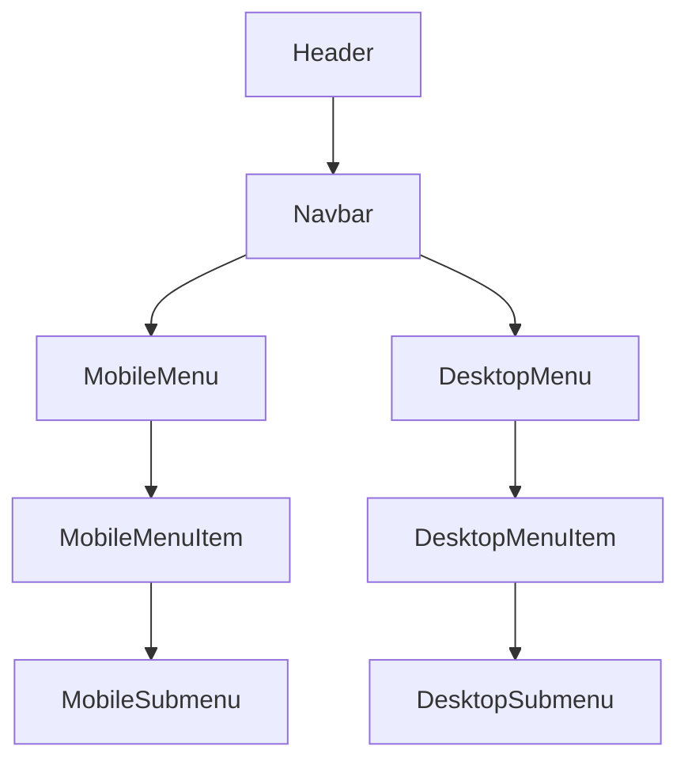

# Navigation Bar Rebuild Plan

## Introduction

This document outlines the plan to remove and rebuild the navigation bar for the Tommy Zion e-commerce site. The primary goal is to fix the dropdown functionality that is currently broken on mobile and tablet views, making the navigation fully responsive across all device sizes.

## 1. Current Implementation Analysis

### Current Structure
- **Header Component** (`src/components/Header/index.tsx`)
  - Main header container with logo, search, and navigation
  - Mobile hamburger toggle with `navigationOpen` state
  - Responsive classes but with potential issues

- **Dropdown Component** (`src/components/Header/Dropdown.tsx`)
  - Uses `dropdownToggler` state for showing/hiding submenus
  - Attempts to detect screen size with `isXlScreen` state
  - Missing proper touch event handling for mobile

- **Menu Data** (`src/components/Header/menuData.ts`)
  - Well-structured data with parent items and submenus

### Identified Issues
1. Dropdown menus don't work properly on mobile/tablet devices
2. Mobile menu toggle doesn't properly interact with dropdown components
3. No proper touch event handling for mobile devices
4. Screen size detection is implemented but not effectively utilized
5. CSS classes may not be properly applied for different viewport sizes

## 2. Removal Strategy

1. Create backup files of current implementation
2. Document current styling and behavior for reference
3. Identify components dependent on current navigation
4. Remove the current implementation in stages:
   - Remove Dropdown component
   - Remove navigation rendering code from Header
   - Maintain essential header structure and functionality (logo, search, cart)

## 3. Rebuild Plan

### 3.1 Component Architecture

### 3.2 New Components to Create

1. **Navbar Component**
   - Container for all navigation elements
   - Responsible for responsive behavior switching

2. **DesktopMenu Component**
   - Horizontal menu for desktop view
   - Handles hover states for dropdowns

3. **DesktopMenuItem Component**
   - Individual menu items for desktop view
   - Handles mouse events for dropdown activation

4. **MobileMenu Component**
   - Full-screen/slide-out menu for mobile view
   - Manages overall mobile menu state

5. **MobileMenuItem Component**
   - Individual menu items for mobile view
   - Handles touch events for accordion-style dropdown

### 3.3 Key Features

1. **Responsive Behavior**
   - Use media queries to control menu display
   - Use CSS transitions for smooth animations
   - Implement different interaction patterns for mobile vs. desktop

2. **Mobile-First Approach**
   - Design mobile view first, then enhance for larger screens
   - Use touch-friendly targets (min 44px height)
   - Implement accordion-style dropdowns for mobile

3. **Desktop Enhancement**
   - Add hover states and animations for desktop
   - Implement dropdown positioning with proper overflow handling
   - Maintain the current styling theme

4. **Accessibility Improvements**
   - Add proper ARIA attributes
   - Implement keyboard navigation
   - Ensure focus management

5. **Performance Optimization**
   - Use React.memo for optimized re-renders
   - Implement efficient event handlers
   - Use CSS transitions instead of JavaScript animations where possible

## 4. Implementation Steps

### Phase 1: Setup and Preparation
1. Create backup of current navigation components
2. Set up new component files structure
3. Create CSS modules for the new components

### Phase 2: Core Components
1. Implement basic Navbar container
2. Build desktop menu with basic functionality
3. Build mobile menu with hamburger toggle

### Phase 3: Dropdown Functionality
1. Implement desktop dropdown with hover behavior
2. Implement mobile dropdown with touch/click behavior
3. Add animation and transitions

### Phase 4: Responsive Behavior
1. Implement media queries and breakpoints
2. Test and adjust behavior on different screen sizes
3. Fine-tune animations and transitions

### Phase 5: Integration and Testing
1. Integrate with Header component
2. Test across devices and browsers
3. Fix any remaining issues

## 5. Technical Specifications

### State Management
- Use React hooks for local state management
- Implement custom hooks for shared functionality:
  - `useMediaQuery` for responsive behavior
  - `useOutsideClick` for closing dropdowns
  - `useKeyboardNavigation` for accessibility

### Event Handling
- Desktop: Use mouse events (mouseenter, mouseleave)
- Mobile: Use touch events with fallback to click events
- Implement event delegation where appropriate

### CSS Approach
- Use CSS modules or styled-components
- Implement mobile-first responsive design
- Maintain the current Tommy Zion styling theme

## 6. Testing Strategy

1. **Functionality Testing**
   - Test on various screen sizes
   - Test with touch and mouse input
   - Test keyboard navigation

2. **Cross-Browser Testing**
   - Test on Chrome, Firefox, Safari, Edge
   - Test on iOS and Android devices

3. **Accessibility Testing**
   - Test with screen readers
   - Test keyboard navigation
   - Validate ARIA attributes

## 7. Timeline Estimate

- **Phase 1 (Setup)**: 1 day
- **Phase 2 (Core Components)**: 2 days
- **Phase 3 (Dropdown Functionality)**: 2 days
- **Phase 4 (Responsive Behavior)**: 2 days
- **Phase 5 (Integration and Testing)**: 2 days

Total estimated time: 9 days