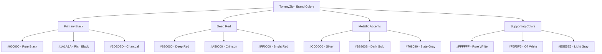
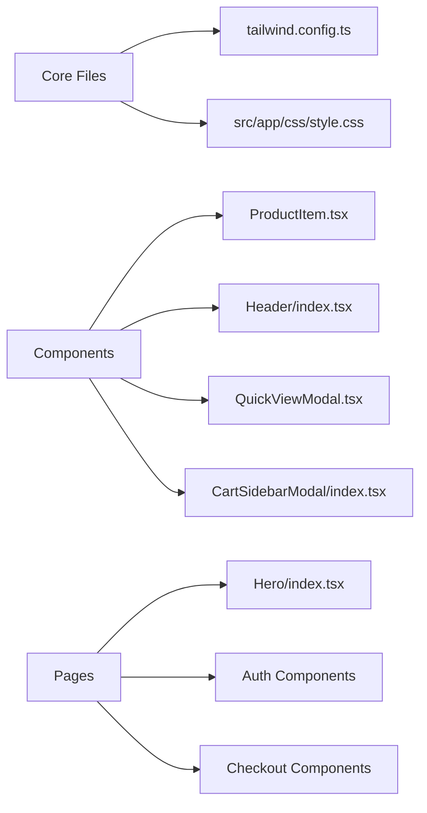
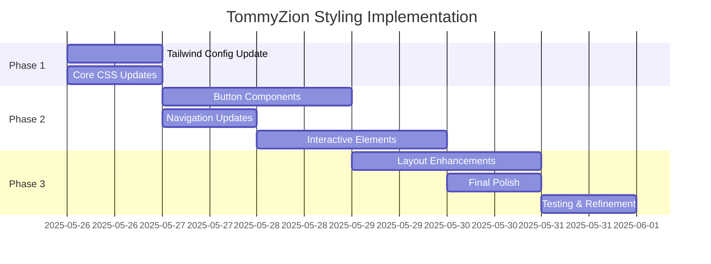

# TommyZion Brand Styling Implementation Plan

Based on the brand values document and current codebase analysis, here's a comprehensive plan to transform the application styling to match the TommyZion brand identity.

## 🎯 **Objective**
Transform the current blue-themed e-commerce application into a TommyZion-branded experience featuring:
- **Black buttons** as primary action elements
- **Deep red highlights** for emphasis and calls-to-action
- **Metallic accents** for premium feel
- **Strong blacks and whites** for contrast and readability
- **Modern & sleek** design philosophy

## 📊 **Current State Analysis**

**Current Color Scheme:**
- Primary: Blue (`#3C50E0`) - used extensively for buttons, links, highlights
- Secondary: Various grays and whites
- Accent: Red (`#F23030`) - currently used sparingly

**Components Using Blue Theme:**
- All "Add to Cart" buttons
- Navigation links and hover states
- Pagination controls
- Form submit buttons
- Quick view and wishlist buttons
- Search and filter controls

## 🎨 **TommyZion Brand Color Palette**



## 🔧 **Implementation Strategy**

### **Phase 1: Tailwind Configuration Update**
1. **Add TommyZion brand colors to [`tailwind.config.ts`](tailwind.config.ts)**
2. **Create semantic color tokens** (primary, secondary, accent)
3. **Maintain existing colors** for backward compatibility

### **Phase 2: Component-Level Updates**
1. **Button Components** - Transform all blue buttons to black
2. **Interactive Elements** - Update hover states and focus indicators
3. **Accent Elements** - Replace blue highlights with deep red
4. **Navigation** - Update header and menu styling

### **Phase 3: Layout and Visual Enhancements**
1. **Hero Section** - Update background and accent colors
2. **Product Cards** - Enhance with metallic accents
3. **Forms** - Update input focus states and submit buttons
4. **Typography** - Enhance contrast and readability

## 📋 **Detailed Implementation Plan**

### **1. Tailwind Config Updates**
```typescript
// Add to tailwind.config.ts colors section
tommyzion: {
  black: {
    DEFAULT: "#000000",
    rich: "#1A1A1A", 
    charcoal: "#2D2D2D"
  },
  red: {
    DEFAULT: "#8B0000",
    crimson: "#A50000",
    bright: "#FF0000",
    light: "#FF4444"
  },
  metallic: {
    silver: "#C0C0C0",
    gold: "#B8860B",
    slate: "#708090"
  }
}
```

### **2. Component Updates Priority Matrix**

| Priority | Component Type | Current State | Target State |
|----------|---------------|---------------|--------------|
| **High** | Add to Cart Buttons | `bg-blue` | `bg-tommyzion-black` |
| **High** | Primary CTAs | `bg-blue` | `bg-tommyzion-black` |
| **High** | Navigation Links | `hover:text-blue` | `hover:text-tommyzion-red` |
| **Medium** | Form Buttons | `bg-blue` | `bg-tommyzion-black` |
| **Medium** | Pagination | `hover:bg-blue` | `hover:bg-tommyzion-red` |
| **Low** | Secondary Actions | `text-blue` | `text-tommyzion-red` |

### **3. Key Files to Update**



### **4. Styling Transformation Rules**

**Button Transformations:**
- `bg-blue` → `bg-tommyzion-black`
- `hover:bg-blue-dark` → `hover:bg-tommyzion-black/90`
- `text-blue` → `text-tommyzion-red`
- `border-blue` → `border-tommyzion-black`

**Interactive Elements:**
- `hover:text-blue` → `hover:text-tommyzion-red`
- `focus:ring-blue` → `focus:ring-tommyzion-red`
- `text-blue` (links) → `text-tommyzion-red`

**Accent Elements:**
- Price highlights: `text-red` → `text-tommyzion-red-crimson`
- Sale badges: Add metallic silver backgrounds
- Premium indicators: Use gold metallic accents

## 🎯 **Expected Outcomes**

### **Visual Impact:**
- **Bold, confident appearance** reflecting TommyZion's "Fearless" value
- **Premium feel** through metallic accents and strong contrasts
- **Modern aesthetic** with clean black and white foundation
- **Strategic red highlights** for calls-to-action and emphasis

### **Brand Alignment:**
- **Strength & Power** - Bold black buttons and strong contrasts
- **Innovation** - Modern color palette and sleek design
- **Authenticity** - Consistent brand application throughout
- **Success-oriented** - Professional, premium appearance

### **User Experience:**
- **Improved contrast** for better accessibility
- **Clear visual hierarchy** with strategic color usage
- **Consistent interaction patterns** across all components
- **Enhanced brand recognition** and memorability

## 📊 **Implementation Timeline**



## 🔍 **Quality Assurance Checklist**

- [ ] All buttons use TommyZion black theme
- [ ] Red highlights applied consistently
- [ ] Metallic accents enhance premium feel
- [ ] Accessibility contrast ratios maintained
- [ ] Hover states and interactions work properly
- [ ] Mobile responsiveness preserved
- [ ] Brand consistency across all pages
- [ ] Performance impact minimized

## 📝 **Brand Values Integration**

### **Core Values Reflected in Design:**

1. **Fearless** - Bold black buttons and confident color choices
2. **Stability** - Consistent application of brand colors throughout
3. **Truth** - Authentic brand representation in every element
4. **Strength** - Strong contrasts and powerful visual hierarchy
5. **Power** - Premium metallic accents and sophisticated palette
6. **Riotousness** - Disruptive departure from typical blue e-commerce themes
7. **Success** - Professional, polished appearance that drives conversions

### **Visual Identity Alignment:**

- **Modern & Sleek**: Clean lines with strong black/white contrasts
- **Dynamic & Action-Oriented**: Red highlights guide user actions
- **Bold Color Palette**: Deep reds, metallic accents, strong blacks and whites
- **Iconography**: Enhanced with consistent color application

### **Brand Messaging Support:**

- **"Train with Power. Live without Limits."** - Reflected in bold, unrestricted design choices
- **"Unleash Your Artistry."** - Creative use of metallic accents and sophisticated palette
- **"The Future of Combat Arts."** - Modern, cutting-edge visual approach

This comprehensive plan will transform your e-commerce application into a true reflection of the TommyZion brand values, creating a bold, modern, and powerful user experience that embodies the revolutionary spirit of modern combat arts.